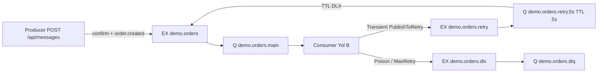

# .NET RabbitMQ Dead Letter Exchange

**Proje kökü:** `dotnet-rabbitmq-dead-letter-exchange/` (`d:\SoftWare\dotnet-rabbitmq-dead-letter-exchange`)

Bu depo, RabbitMQ üzerinde **Dead Letter Exchange (DLX)**, **TTL ile gecikmeli retry** ve **uygulama düzeyinde sınırlı yeniden deneme (Yol B)** kalıplarını gösteren eğitim örneğidir. Gerçek müşteri kodu veya gizli yapılandırma içermez; açık kaynak paylaşımına uygundur.

Hedef çerçeve: **.NET 8 LTS / `net8.0`**. İstemci: **RabbitMQ.Client 7.x** (stabil async API).

İlgili makale: [RabbitMQ Dead Letter Exchange — 7 Adımda Güvenli Mesaj Hata Yönetimi](https://www.mehmet-ozdemir.com.tr/rabbitmq-dead-letter-exchange-7-adimda-guvenli-mesaj-hata-yonetimi/)

## Yazar

**Mehmet Özdemir** — [Web sitesi](https://www.mehmet-ozdemir.com.tr/)

## Bu Proje Neyi Gösteriyor?

| Konu | Özet |
|------|------|
| Transient vs Poison | Geçici hatalar retry edilir; zehirli (işlenemez) mesajlar doğrudan DLQ’ya gider |
| DLX ≠ retry | DLX bir yönlendirme mekanizmasıdır; “kaç kez dene” kararı uygulama veya politika ile verilir |
| TTL retry | `demo.orders.retry.5s` kuyruğunda `x-message-ttl=5000`; süre bitince mesaj ana exchange’e döner |
| Sınırlı retry | Header `x-demo-retry-count`; `MaxRetry=3` aşılınca DLQ |
| Manual ACK | `autoAck=false`; başarılı iş / retry yayını / DLQ yayını sonrası **Ack** |
| Confirm ≠ Ack | Publisher confirm broker’ın yayın kabulüdür; consumer Ack tüketici onayıdır |
| DLQ izleme | `demo.orders.dlq` doluluğu alarm ve inceleme gerektirir |
| At-least-once + idempotency | Yeniden teslim mümkün; iş mantığı idempotent olmalıdır |
| Policy vs x-arguments | Demo `x-arguments` kullanır; üretimde operator policy tercih edilebilir |
| `guest` uyarısı | `guest` yalnızca yerel demoda; production’da ayrı kullanıcı ve ağ kısıtı şarttır |

## Mimari



### Topoloji (sabit isimler)

- **EX** `demo.orders` → **Q** `demo.orders.main` rk=`order.created`  
  - main args: `x-dead-letter-exchange=demo.orders.retry`, `x-dead-letter-routing-key=retry.5s`
- **EX** `demo.orders.retry` → **Q** `demo.orders.retry.5s` rk=`retry.5s`  
  - retry Q: `x-message-ttl=5000`, `x-dead-letter-exchange=demo.orders`, `x-dead-letter-routing-key=order.created`
- **EX** `demo.orders.dlx` → **Q** `demo.orders.dlq` rk=`dead`

### Retry yolu B (zorunlu)

1. **None** → işle + **Ack**
2. **Transient** ve `retryCount < MaxRetry` → `PublishToRetry(retry+1)` + **publisher confirm** + **Ack**
3. **Transient** ve `retryCount >= MaxRetry` → `PublishToDlq` + **Ack**
4. **Poison** → `PublishToDlq` + **Ack**
5. **`requeue=true` kullanılmaz**

## Çözüm yapısı

```text
dotnet-rabbitmq-dead-letter-exchange.sln
src/RabbitMqDlx.Producer/     Minimal API — POST /api/messages, GET /health (+ Dockerfile)
src/RabbitMqDlx.Consumer/     Worker — main kuyruk tüketimi (+ Dockerfile)
src/RabbitMqDlx.Shared/       Models, Options, Topology, RetryDecision, Headers, LogEvents
tests/RabbitMqDlx.Tests/      Broker gerektirmeyen birim testleri
docker-compose.yml            RabbitMQ + isteğe bağlı producer/consumer (profile: apps)
docker/rabbitmq/              Demo RabbitMQ conf (guest uzak bağlantı — yalnız local)
.env.example                  Compose placeholder’ları (secret yok)
```

## API

| Uç nokta | Açıklama |
|----------|----------|
| `POST /api/messages` | Gövde: `FailureMode` = `None` \| `Transient` \| `Poison`. Publisher confirm sonrası **202 Accepted** |
| `GET /health` | Sağlık kontrolü |

Örnek gövde:

```json
{
  "customerId": "c-100",
  "amount": 149.90,
  "failureMode": "None"
}
```

## Başlangıç

### Gereksinimler

- .NET SDK **8.0** (`net8.0`)
- Docker (RabbitMQ için)

### Yapılandırma

Gerçek `appsettings.json` Git’e eklenmez. Şablonu kopyalayın:

```bash
cd d:\SoftWare\dotnet-rabbitmq-dead-letter-exchange\src\RabbitMqDlx.Producer
copy appsettings.example.json appsettings.json

cd d:\SoftWare\dotnet-rabbitmq-dead-letter-exchange\src\RabbitMqDlx.Consumer
copy appsettings.example.json appsettings.json
```

Linux / macOS:

```bash
cp appsettings.example.json appsettings.json
```

### Docker (RabbitMQ + isteğe bağlı uygulamalar)

> **Uyarı:** `guest` / `guest` ve `loopback_users.guest = false` yalnızca **yerel demo** içindir. Production’da ayrı kullanıcı, güçlü parola, TLS ve ağ kısıtı kullanın. `.env` commit edilmez; gerçek secret eklemeyin.
>
> Compose portları (`5672`, `15672`, Producer) `127.0.0.1` ile bağlanır; yalnızca bu makineden erişilir (LAN’a açık değildir).

İsteğe bağlı ortam dosyası:

```bash
cd d:\SoftWare\dotnet-rabbitmq-dead-letter-exchange
copy .env.example .env
```

Yalnız broker (host’ta `dotnet run` için):

```bash
cd d:\SoftWare\dotnet-rabbitmq-dead-letter-exchange
docker compose up -d rabbitmq
```

Management UI: http://localhost:15672 (`guest` / `guest` — yalnızca yerel).  
AMQP: `localhost:5672`

Tam yığın (RabbitMQ + Producer + Consumer; imajlar **.NET 8** multi-stage):

```bash
cd d:\SoftWare\dotnet-rabbitmq-dead-letter-exchange
docker compose --profile apps up -d --build
```

- Producer API: http://localhost:5080 (`GET /health`, `POST /api/messages`)
- Consumer: aynı Docker ağında `rabbitmq` host adına bağlanır
- Durdurma: `docker compose --profile apps down`

Doğrulama örnekleri:

```bash
docker compose config
docker compose ps
docker compose exec rabbitmq rabbitmq-diagnostics -q ping
```

### Consumer (host)

```bash
cd d:\SoftWare\dotnet-rabbitmq-dead-letter-exchange\src\RabbitMqDlx.Consumer
dotnet run
```

### Producer (host)

```bash
cd d:\SoftWare\dotnet-rabbitmq-dead-letter-exchange\src\RabbitMqDlx.Producer
dotnet run
```

Varsayılan adres `launchSettings.json` ile genelde `http://localhost:5080`dır.

### Smoke senaryoları (broker + consumer + producer)

Önkoşul: RabbitMQ ayakta (`docker compose up -d rabbitmq`), Consumer ve Producer host’ta `dotnet run` ile çalışıyor (veya `docker compose --profile apps up -d --build`).

| # | Senaryo | İstek | Beklenen |
|---|---------|-------|----------|
| 1 | Normal ACK | `failureMode: None` | Consumer işler + **Ack**; `demo.orders.main` / DLQ boş kalır |
| 2 | Transient → retry | `failureMode: Transient` | Consumer `PublishToRetry` + Ack; mesaj `demo.orders.retry.5s` (TTL 5s) → ana kuyruğa döner; `MaxRetry` aşılınca DLQ |
| 3 | Poison → DLQ | `failureMode: Poison` | Consumer doğrudan `PublishToDlq` + Ack; mesaj `demo.orders.dlq` |

Management UI’da kuyrukları izleyin: http://localhost:15672 → Queues (`demo.orders.main`, `demo.orders.retry.5s`, `demo.orders.dlq`).

Sağlık:

```bash
curl -s http://localhost:5080/health
```

1) Normal mesaj (ACK):

```bash
curl -s -X POST http://localhost:5080/api/messages ^
  -H "Content-Type: application/json" ^
  -d "{\"customerId\":\"c-1\",\"amount\":10,\"failureMode\":\"None\"}"
```

2) Transient (TTL retry; MaxRetry sonrası DLQ):

```bash
curl -s -X POST http://localhost:5080/api/messages ^
  -H "Content-Type: application/json" ^
  -d "{\"customerId\":\"c-2\",\"amount\":20,\"failureMode\":\"Transient\"}"
```

Consumer logunda `Transient → retry kuyruğu` ve birkaç döngü sonra `MaxRetry aşıldı → DLQ` beklenir. UI’da `demo.orders.retry.5s` Ready/Unacked geçici artar, ardından `demo.orders.dlq` artar.

3) Poison (doğrudan DLQ):

```bash
curl -s -X POST http://localhost:5080/api/messages ^
  -H "Content-Type: application/json" ^
  -d "{\"customerId\":\"c-3\",\"amount\":30,\"failureMode\":\"Poison\"}"
```

Consumer logunda `Poison → DLQ`; UI’da `demo.orders.dlq` Ready artar. **`requeue=true` kullanılmaz.**

> Port, `launchSettings.json` veya `--urls` ile değişebilir. `dotnet run` çıktısındaki dinleme adresini kullanın.

### Testler

```bash
cd d:\SoftWare\dotnet-rabbitmq-dead-letter-exchange
dotnet test
```

Broker gerekmez.

## CI

`main` dalına **push** ve **pull_request** için GitHub Actions workflow’u (`.github/workflows/ci.yml`) çalışır: .NET SDK **8.0.x**, ardından `dotnet restore` → `dotnet build --no-restore` → `dotnet test --no-build` (`dotnet-rabbitmq-dead-letter-exchange.sln`). Secret veya registry adımı yoktur; yalnızca birim testleri (broker gerekmez).

## Production’a bırakılan noktalar (demo dışı)

- Kimlik doğrulama / yetkilendirme yok
- Idempotent iş deposu yok (aynı `OrderId` yeniden işlenebilir)
- DLQ için operatör paneli, alarm ve poison replay aracı yok
- Bağlantı havuzu / çoklu tüketici ölçeklendirmesi minimal
- TLS, üretim kullanıcıları ve network policy yok
- Operator **policy** ile DLX argümanlarının merkezi yönetimi yok

## Lisans

MIT — Mehmet Özdemir — https://www.mehmet-ozdemir.com.tr/
